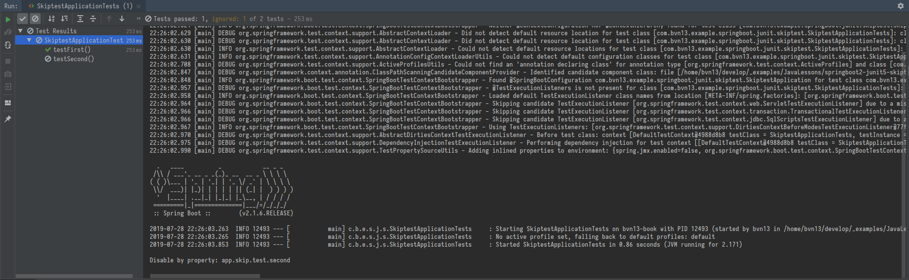

# SpringBoot JUnit5 SkipTest

* SpringBoot 2
* JUnit 5

# Prerequisites

Imagine the situation that your project must be built on several environments.

Imagine that all tests you've implemented must not be run on each environment.

And you prefer to select which of them should be run by setting it up with... `application.properties` file with concrete property per test.

Looks like delicious, doesn't it?

# Settings

First of all let's disable JUnit 4 supplied in SpringBoot2 by default and enable [JUnit 5](https://junit.org/junit5/docs/current/user-guide/#overview).

Changes in `pom.xml` are:

```xml
<dependencies>
    <!--...-->
    <dependency>
        <groupId>org.springframework.boot</groupId>
        <artifactId>spring-boot-starter-test</artifactId>
        <scope>test</scope>
        <exclusions>
            <exclusion>
                <groupId>junit</groupId>
                <artifactId>junit</artifactId>
            </exclusion>
        </exclusions>
    </dependency>
    <dependency>
        <groupId>org.junit.jupiter</groupId>
        <artifactId>junit-jupiter-engine</artifactId>
        <version>5.3.2</version>
        <scope>test</scope>
    </dependency>
    <!--...-->
</dependencies>
```

# Solution

We'd like to annotate each test with simple annotation and point on application property to check if it is `true` to start the test.

## Annotation

Here is our [annotation](src/test/java/com/bvn13/example/springboot/junit/skiptest/TestEnabled.java):

```java
@Retention(RetentionPolicy.RUNTIME)
@ExtendWith(TestEnabledCondition.class)
public @interface TestEnabled {
    String property();
}
```

## Annotation processor

But this annotation is nothing without its processor.

```java
public class TestEnabledCondition implements ExecutionCondition {

    @Override
    public ConditionEvaluationResult evaluateExecutionCondition(ExtensionContext context) {
        Optional<TestEnabled> annotation = context.getElement().map(e -> e.getAnnotation(TestEnabled.class));

        return context.getElement()
                        .map(e -> e.getAnnotation(TestEnabled.class))
                        .map(annotation -> {
                            String property = annotation.property();
        
                            return Optional.ofNullable(environment.getProperty(property, Boolean.class))
                                    .map(value -> {
                                        if (Boolean.TRUE.equals(value)) {
                                            return ConditionEvaluationResult.enabled("Enabled by property: "+property);
                                        } else {
                                            return ConditionEvaluationResult.disabled("Disabled by property: "+property);
                                        }
                                    }).orElse(
                                            ConditionEvaluationResult.disabled("Disabled - property <"+property+"> not set!")
                                    );
                        }).orElse(
                                ConditionEvaluationResult.enabled("Enabled by default")
                        );
    }
}
```

You must create a class (without Spring @Component annotation) which implements ExecutionCondition interface.

Then you must implement one method of this interface - `ConditionEvaluationResult evaluateExecutionCondition(ExtensionContext context)`.

This method takes JUnit test's execution context and returns the condition - should the test be started or not. Simply, right?

You can read more about [Conditional test execution with JUnit5](https://junit.org/junit5/docs/current/user-guide/#extensions-conditions) in official documentation as well.

But how to check application property in this context?

## Obtaining the access to SpringBoot context from JUnit context

Here is the snippet to obtain Spring environment right from the ExtensionContext of JUnit:

```java
Environment environment = SpringExtension.getApplicationContext(context).getEnvironment();
```

Take a look at [full class code of TestEnabledCondition](https://github.com/bvn13/JavaLessons/blob/9a34719dbc7b616f0234e4dcd0d5376905aacc2e/springboot2-junit5-skiptest/src/test/java/com/bvn13/example/springboot/junit/skiptest/TestEnabledCondition.java)

# Make some tests

It's showtime!

Let's create our tests and manage them starts:

```java
@SpringBootTest
public class SkiptestApplicationTests {

    @TestEnabled(property = "app.skip.test.first")
    @Test
    public void testFirst() {
        assertTrue(true);
    }

    @TestEnabled(property = "app.skip.test.second")
    @Test
    public void testSecond() {
        assertTrue(false);
    }

}
```

Our `application.propertis` file is look like:

```properties
app.skip.test.first=true
app.skip.test.second=false
```

So...

The result:



# Next step - generalizing properties' names

It is so annoyingly to write the full path to our application properties in every test.

So the next step is to generalify that path in test class annotation.

Let's create a new [annotation](src/test/java/com/bvn13/example/springboot/junit/skiptest/TestEnabledPrefix.java) called `TestEnabledPrefix`:

``` java
@Target(ElementType.TYPE)
@Retention(RetentionPolicy.RUNTIME)
public @interface TestEnabledPrefix {
    String prefix();
}
```

## TestEnabledPrefix annotation usage

There is no way avoiding new annotation processing:

``` java
public class TestEnabledCondition implements ExecutionCondition {

    @Override
    public ConditionEvaluationResult evaluateExecutionCondition(ExtensionContext context) {
        Environment environment = SpringExtension.getApplicationContext(context).getEnvironment();

        return context.getElement()
                        .map(e -> e.getAnnotation(TestEnabled.class))
                        .map(annotation -> {
                            String property = annotation.property();
        
                            String prefix = context.getTestClass()
                                    .map(cl -> cl.getAnnotation(TestEnabledPrefix.class))
                                    .map(pref -> {
                                        if (!pref.prefix().isEmpty() && !pref.prefix().endsWith(".")) {
                                            return pref.prefix()+".";
                                        } else {
                                            return "";
                                        }
                                    }).orElse("");
        
                            return Optional.ofNullable(environment.getProperty(prefix + property, Boolean.class))
                                    .map(value -> {
                                        if (Boolean.TRUE.equals(value)) {
                                            return ConditionEvaluationResult.enabled("Enabled by property: "+property);
                                        } else {
                                            return ConditionEvaluationResult.disabled("Disabled by property: "+property);
                                        }
                                    }).orElse(
                                            ConditionEvaluationResult.disabled("Disabled - property <"+property+"> not set!")
                                    );
                        }).orElse(
                                ConditionEvaluationResult.enabled("Enabled by default")
                        );
    }

}
```

You can take a look at [full class code](src/test/java/com/bvn13/example/springboot/junit/skiptest/TestEnabledCondition.java) folowing to link.

## New annotation usage

And now we'll apply new annotation to aour [test class](src/test/java/com/bvn13/example/springboot/junit/skiptest/SkiptestApplicationTests.java):

``` java
@SpringBootTest
@TestEnabledPrefix(property = "app.skip.test")
public class SkiptestApplicationTests {

    @TestEnabled(property = "first")
    @Test
    public void testFirst() {
        assertTrue(true);
    }

    @TestEnabled(property = "second")
    @Test
    public void testSecond() {
        assertTrue(false);
    }

}
```

Much more clear and obvious code.


## Thanks to...

1) Reddit user [dpash](https://www.reddit.com/user/dpash/)