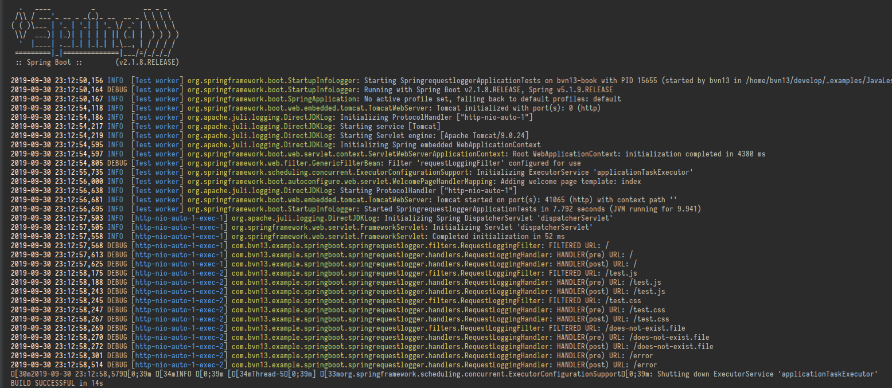

# How to log every Request in SpringBoot

## Prerequesites

Imagine we have an web SpringBoot application containing a [Controller](./src/main/java/com/bvn13/example/springboot/springrequestlogger/controllers/FirstController.java).
It returns a template [index](/src/main/resources/templates/index.html) containing two links: on [css file](./src/main/resources/static/test.css) and on [js file](./src/main/resources/static/test.js).

So we want to log every request from client while opening `index.html`:
1. `index.html`
2. `test.css`
3. `test.js`

## Enabling logging

We must set up the logging of our classes. Take a look at example of [logback-spring.xml](./src/main/resources/logback-spring.xml).

## Build a Filter

Every Spring Web application have a chain on different filters. Every request flows through this filter chain before getting a controller.

So we can implement a [logging filter](./src/main/java/com/bvn13/example/springboot/springrequestlogger/filters/RequestLoggingFilter.java) and put it into Spring Filter Chain to achieve our goal.

```java
@Slf4j
@Component
public class RequestLoggingFilter extends OncePerRequestFilter {
    @Override
    protected void doFilterInternal(HttpServletRequest request, HttpServletResponse response, FilterChain filterChain) throws ServletException, IOException {
        log.debug(
                String.format("FILTERED URL: %s", request.getRequestURI())
        );

        //continue filtering
        filterChain.doFilter(request, response);
    }
}
```

Using `@Slf4j` annotation get us to decrease boilerplate code to have a logger in a class.

We must annotate our class with `@Component` annotation to make SpringBoot to instantiate this class as spring bean in Singleton scope.

Our class extends `OncePerRequestFilter` abstract class so every request goes through our filter only once.

And we are able to log anything regarding the request inside `doFilterInternal` method.

### Result

You may run [testControllerLoggingWithFilter](./src/test/java/com/bvn13/example/springboot/springrequestlogger/SpringrequestloggerApplicationTests.java) to see the result

```java
    @Test(expected = HttpClientErrorException.NotFound.class)
    public void testControllerLoggingWithFilter() {
        restTemplate.getForObject("http://localhost:"+port+"/", String.class);
        restTemplate.getForObject("http://localhost:"+port+"/test.js", String.class);
        restTemplate.getForObject("http://localhost:"+port+"/test.css", String.class);
        restTemplate.getForObject("http://localhost:"+port+"/does-not-exist.file", String.class);
    }
```


So our goal is achieved. We can see all files we request and not existing file too.


## Building a Handler Interceptor

Handler interceptors have more power to process your requests since they handle not the fact of request but its events: before request, after request, after completion.

You can check out Spring class `org.springframework.web.servlet.handler.HandlerInterceptorAdapter` to see its methods we are able to implement in our handler.

Lets [our handler](/src/main/java/com/bvn13/example/springboot/springrequestlogger/handlers/RequestLoggingHandler.java) implement `preHandle` and `postHandle` events:

```java
    @Override
    public boolean preHandle(HttpServletRequest request, HttpServletResponse response, Object handler) throws Exception {
        log.debug(
                String.format("HANDLER(pre) URL: %s", request.getRequestURI())
        );

        return super.preHandle(request, response, handler);
    }

    @Override
    public void postHandle(HttpServletRequest request, HttpServletResponse response, Object handler, ModelAndView modelAndView) throws Exception {
        log.debug(
                String.format("HANDLER(post) URL: %s", request.getRequestURI())
        );

        super.postHandle(request, response, handler, modelAndView);
    }
```

But the handler will not work until we actually tell Spring to use it. We must build a [configuration](/src/main/java/com/bvn13/example/springboot/springrequestlogger/handlers/WebApplicationConfiguration.java) to enable our handler.

```java
@Configuration
public class WebApplicationConfiguration implements WebMvcConfigurer {

    @Setter(onMethod_ = @Autowired)
    private RequestLoggingHandler requestLogger;

    @Override
    public void addInterceptors(InterceptorRegistry registry) {
        registry.addInterceptor(requestLogger);
    }
}
```

### Result 

Lets start our test to check out the result!



